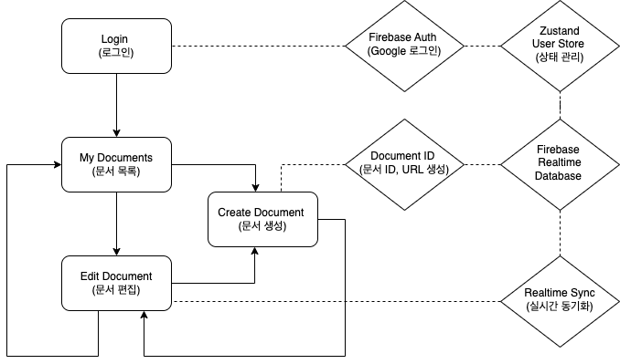

# 함께 문서 만들기 프로젝트

## 프로젝트 설명

이 프로젝트는 사용자들이 함께 실시간으로 문서를 작성하고 관리할 수 있도록 돕는 웹 애플리케이션입니다. Firebase와 React를 사용하여 인증, 데이터 저장 및 동기화 기능을 제공합니다. 이 애플리케이션을 통해 사용자들은 새 문서를 만들고, 문서의 내용을 수정하며, 로그인 및 로그아웃 등의 작업을 수행할 수 있습니다.

## 주요 기능

- **로그인 페이지**: 사용자는 구글 계정을 이용해 애플리케이션에 로그인할 수 있습니다.
- **문서 생성**: 새 문서를 생성할 수 있는 모달을 통해 간단히 제목을 입력하고 문서를 생성할 수 있습니다.
- **문서 편집**: 생성된 문서를 실시간으로 편집할 수 있으며, 모든 변경사항은 Firebase Realtime Database에 저장됩니다.
- **사용자 인증**: Firebase Auth를 이용해 사용자 인증을 관리하며, 인증된 사용자만 문서를 생성하고 편집할 수 있습니다.
- **로그아웃**: 헤더에서 로그아웃 버튼을 통해 사용자가 로그아웃할 수 있습니다.

## 파일 구조

- **CreateDocumentModal.jsx**: 새 문서를 생성하는 모달 컴포넌트를 포함합니다.
- **DocumentEditor.jsx**: 사용자가 문서를 편집할 수 있는 에디터 페이지입니다.
- **DocumentList.jsx**: 사용자가 접근할 수 있는 문서 목록을 보여줍니다.
- **Header.jsx**: 사용자 정보와 로그아웃 기능을 제공하는 헤더 컴포넌트입니다.
- **LoginPage.jsx**: 사용자가 로그인할 수 있는 로그인 페이지를 구현합니다.

## 주요 라이브러리

- **Firebase**: 인증, 실시간 데이터베이스, 호스팅 등을 제공하는 백엔드 서비스입니다.
- **Firebase Auth**: 사용자 인증을 관리하기 위해 사용합니다.
- **Firebase Realtime Database**: 실시간 데이터 동기화를 위해 사용합니다.
- **Zustand**: 전역 상태 관리를 간단하게 구현하기 위해 사용합니다.

